# Desyatkoff Dotfiles

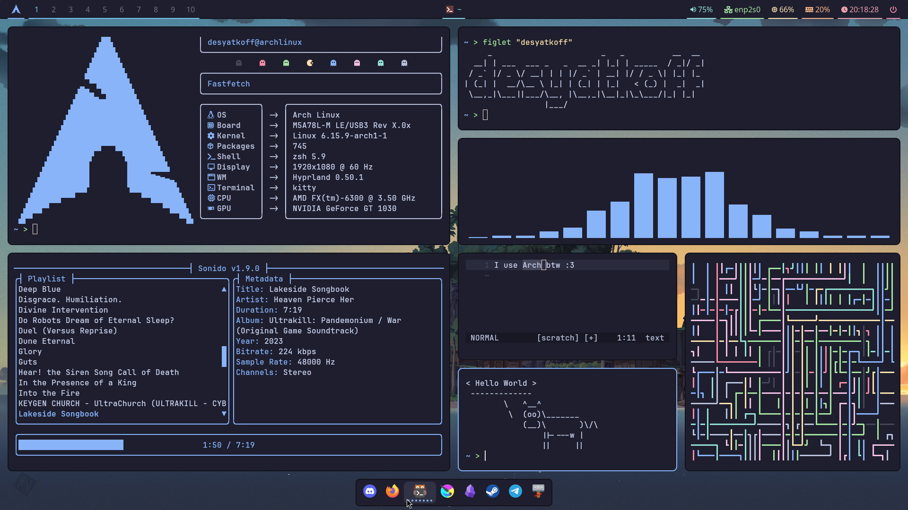

* Operating System: [`Arch Linux`](https://archlinux.org)
* Terminal Shell: [`Zsh`](https://www.zsh.org)
* Text Editor: [`Helix`](https://helix-editor.com)
* Window Compositor: [`Hyprland`](https://hypr.land)
* Theme: [`Catppuccin Mocha`](https://catppuccin.com)
* Icons: [`Papirus Dark`](https://github.com/PapirusDevelopmentTeam/papirus-icon-theme)
* Terminal: [`Kitty`](https://sw.kovidgoyal.net/kitty/)
* Status Bar: [`Waybar`](https://github.com/Alexays/Waybar)
* Launcher: [`Rofi`](https://github.com/davatorium/rofi)
* Dock Panel: [`Hydock`](https://github.com/desyatkoff/hydock)

<br />

<p align="center">
    &ensp;<a href="#description"><kbd>&ensp;<br />&ensp;&ensp;Description&ensp;&ensp;<br />&ensp;</kbd></a>&ensp;
    &ensp;<a href="#features"><kbd>&ensp;<br />&ensp;&ensp;Features&ensp;&ensp;<br />&ensp;</kbd></a>&ensp;
    &ensp;<a href="#installation"><kbd>&ensp;<br />&ensp;&ensp;Installation&ensp;&ensp;<br />&ensp;</kbd></a>&ensp;
    &ensp;<a href="#shortcuts"><kbd>&ensp;<br />&ensp;&ensp;Shortcuts&ensp;&ensp;<br />&ensp;</kbd></a>&ensp;
    &ensp;<a href="#demo"><kbd>&ensp;<br />&ensp;&ensp;Demo&ensp;&ensp;<br />&ensp;</kbd></a>&ensp;
</p>

## Description

This repository stores my dotfiles that I personally use. Maybe not the best rice because I'm not pro but at least it's not trashy Windows and also it's good enough for efficient work

README is currently available in two languages:
* [`English`](README.en.md)
* [`Русский`](README.ru.md)

## Features

* Simple & lightweight (~900 MiB of RAM usage on idle)
* Smooth animations
* Beautiful Catppuccin color palette with Mocha variation
* Modular structure
* Useful shortcuts
* Convenient installation process
* Permission to use that one phrase - "I use Arch btw" :)

## Installation

Choose your preferred installation method:

* `git clone` the repository and launch installer script
    ```Shell
    git clone https://github.com/desyatkoff/dotfiles.git && cd dotfiles/ && bash ./install.sh
    ```
* `curl` the installer script
    ```Shell
    bash <(curl -fsSL https://raw.githubusercontent.com/desyatkoff/dotfiles/main/install.sh)
    ```

It is recommended to reboot after the installation process done

## Shortcuts

* `Super` + `Enter` -> Launch Kitty
* `Super` + `E` -> Launch Thunar
* `Super` + `B` -> Launch Firefox
* `Super` + `Shift` + `B` -> Launch Firefox (private window)
* `Super` + `Q` -> Close active window
* `Super` + `Shift` + `Q` -> Close active window (force) 
* `Super` + `L` -> Lock
* `Super` + `F` -> Toggle floating mode for active window
* `Super` + `Shift` + `F` -> Toggle fullscreen mode for active window
* `Super` + `J` -> Toggle split mode
* `Super` + `N` -> Toggle SwayNC panel
* `Alt` + `Tab` -> Cycle active windows
* `Super` + `G` -> Toggle "Game Mode" (less eye candy stuff -> more performance)
* `Super` + `Print Screen` -> Start/Stop screen recording
* `Print Screen` -> Take a screenshot
* `Super` + `V` -> Open clipboard
* `Super` + `Alt` + `W` -> Toggle wallpaper switcher
* `Super` + `Space` -> Toggle Rofi
* `Super` + `W` -> Toggle Waybar
* `Super` + `P` -> Launch screen color picker
* `Super` + `D` -> Toggle Hydock
* `Super` + `←` / `→` / `↑` / `↓` -> Move focus
* `Super` + `Shift` + `←` / `→` / `↑` / `↓` -> Move window
* `Super` + `Control` + `←` / `→` / `↑` / `↓` -> Resize window
* `Super` + `1` / `2` / `3` / `4` / `5` / `6` / `7` / `8` / `9` / `0` -> Go to workspace
* `Super` + `Shift` + `1` / `2` / `3` / `4` / `5` / `6` / `7` / `8` / `9` / `0` -> Move active window to workspace
* `Super` + `S` -> Go to special workspace
* `Super` + `Shift` + `S` -> Move active window to special workspace
* See [`~/.config/hypr/hyprland/binds.conf`](home/.config/hypr/hyprland/binds.conf) for more

## Demo

<p align="center">
    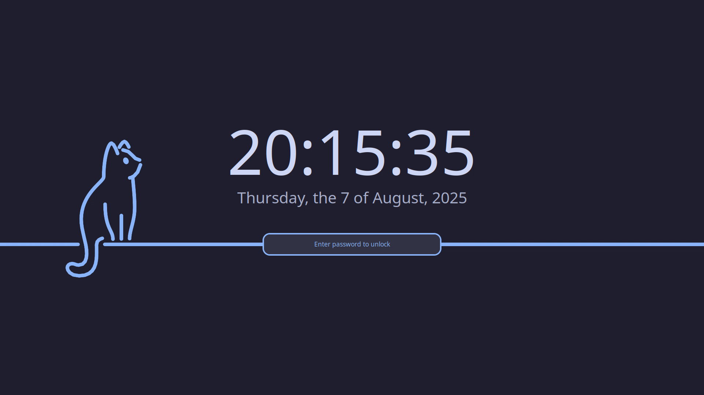
    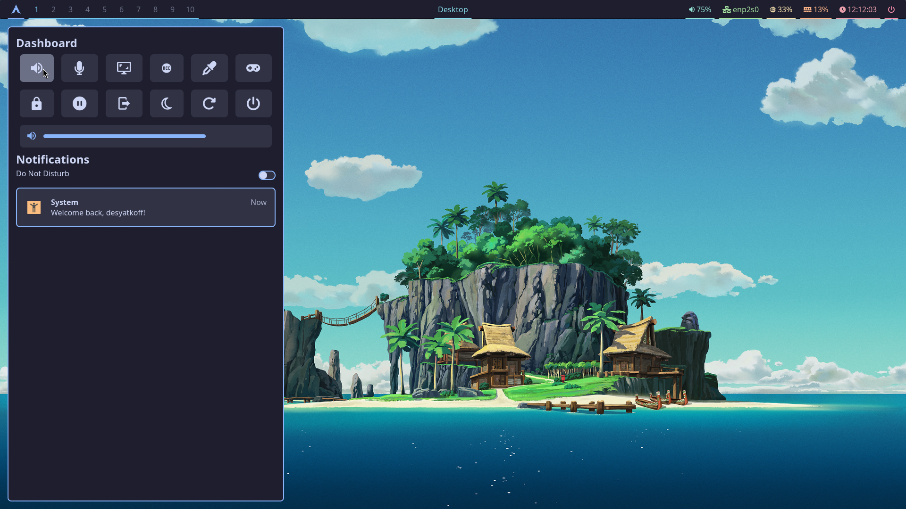
    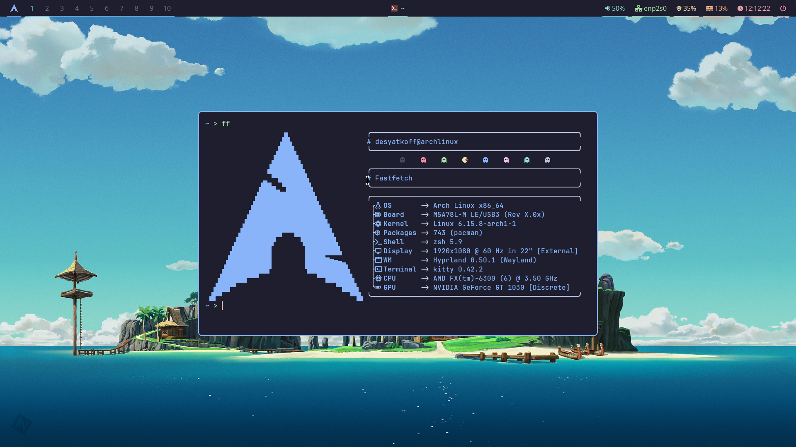
    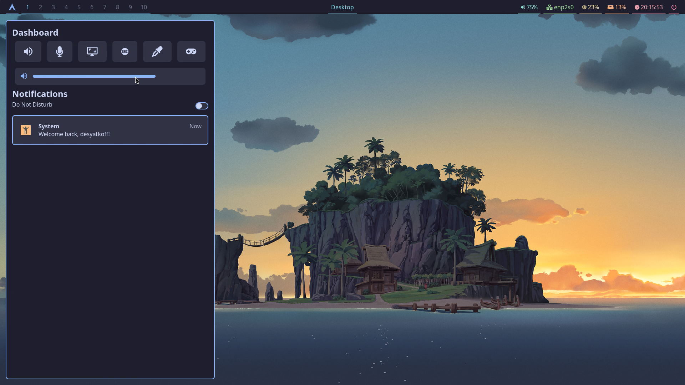
    
    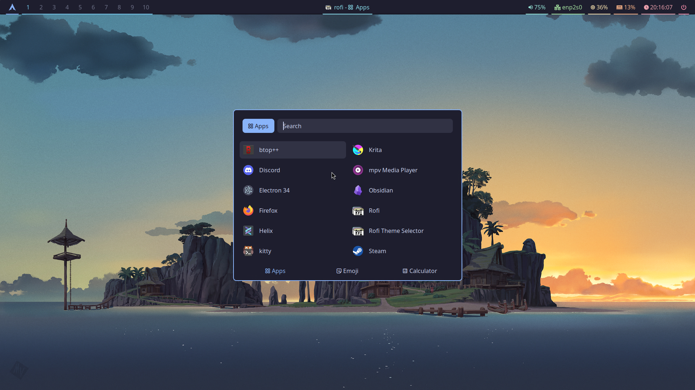
    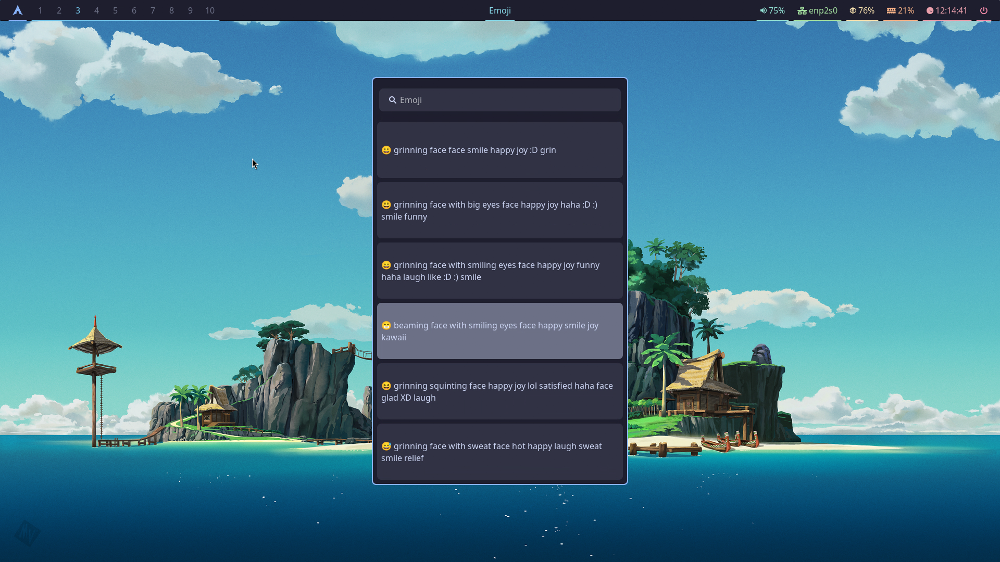
    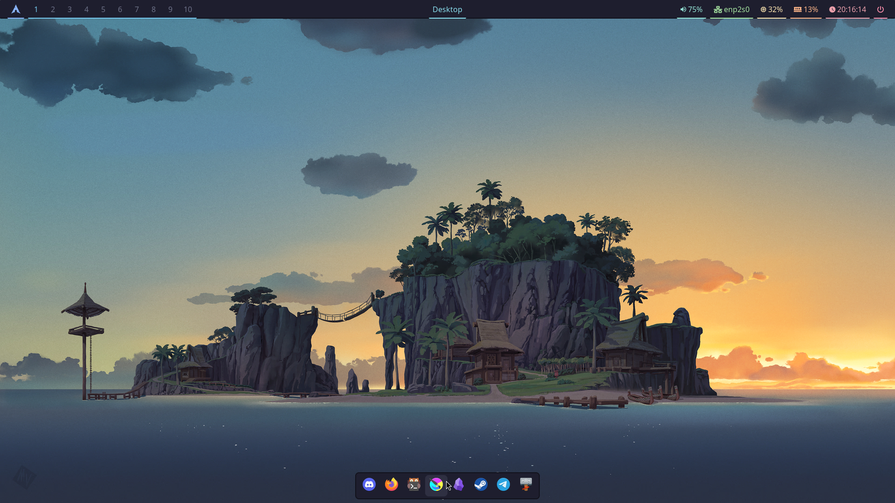
    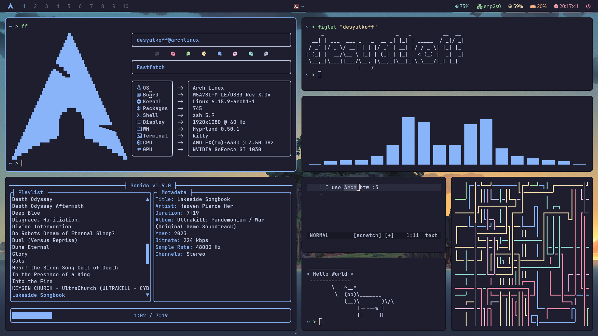
    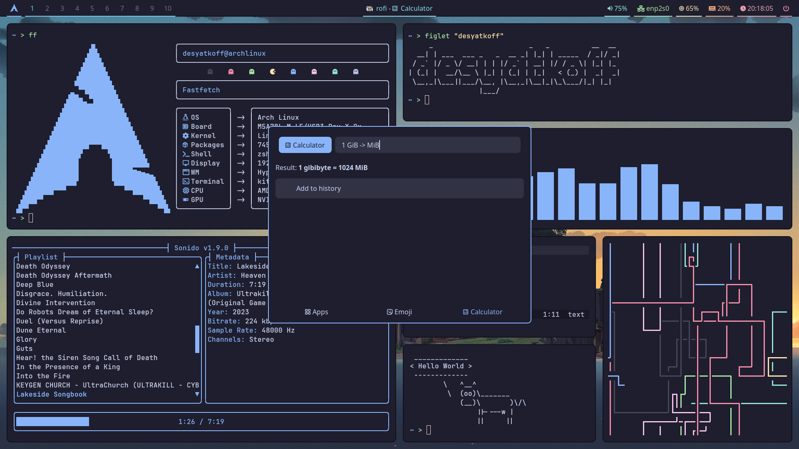
    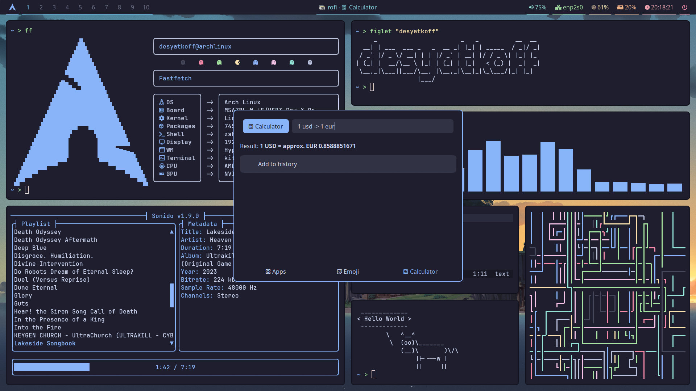
    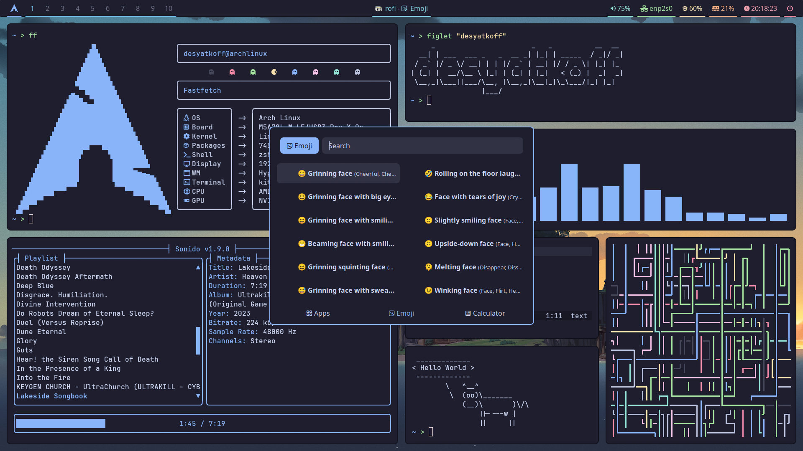
    
    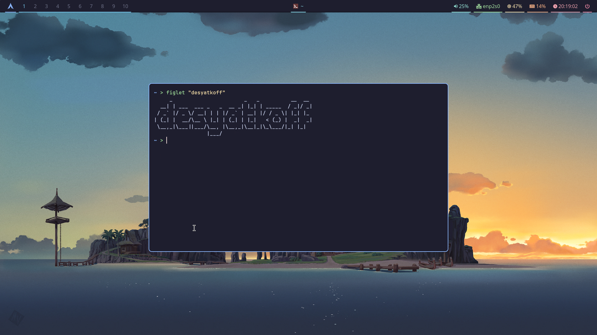
    
    
    
</p>
