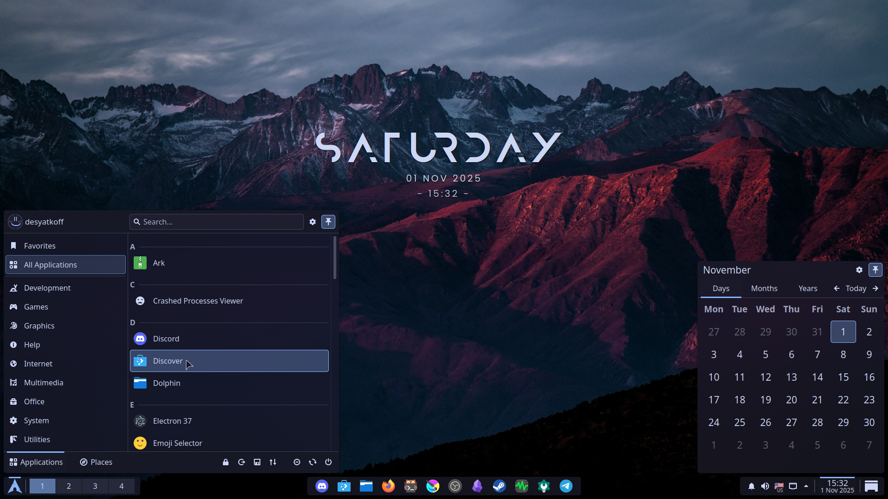
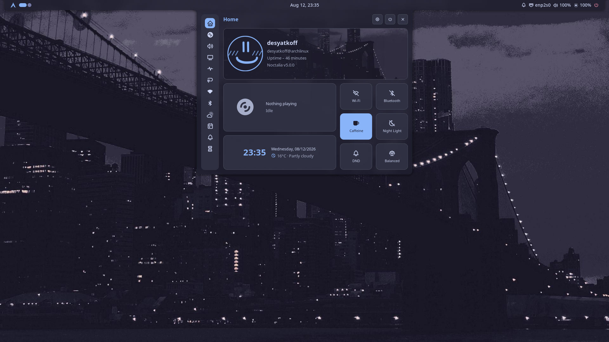
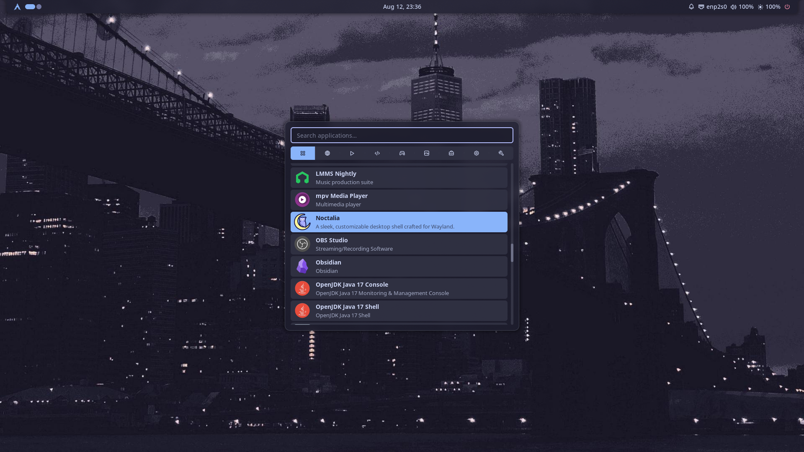
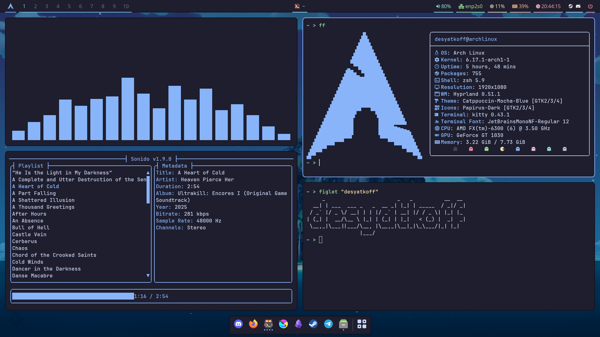

# Dotfiles

* Operating System: [`Arch Linux`](https://archlinux.org)
* Terminal Shell: [`Zsh`](https://www.zsh.org)
* Wayland Compositor: [`Niri`](https://niri-wm.github.io/niri/)
* Theme: [`Catppuccin Mocha`](https://catppuccin.com)
* Icons: [`Papirus`](https://github.com/PapirusDevelopmentTeam/papirus-icon-theme)
* Terminal: [`Kitty`](https://sw.kovidgoyal.net/kitty)
* Terminal Font: [`JetBrains Mono`](https://www.jetbrains.com/lp/mono)

## Demo

    
    
    
    

