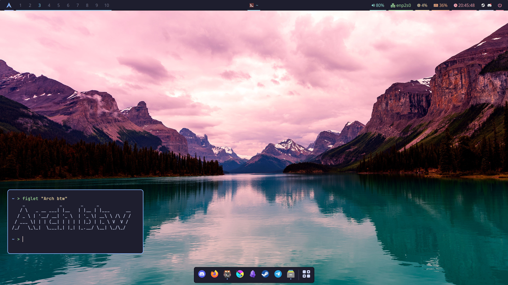
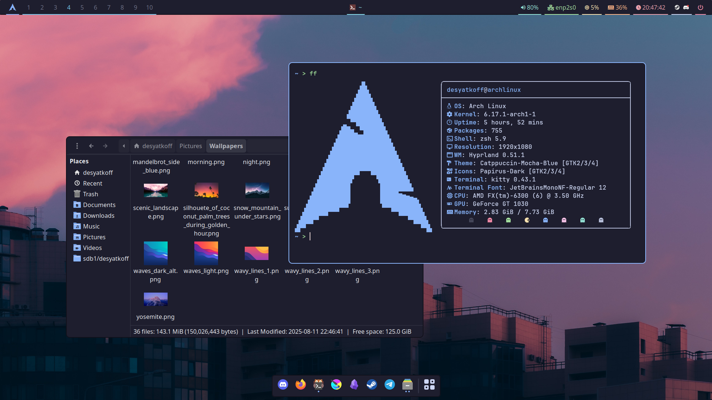

> [!WARNING]
> Formerly, this repository stored Hyprland configs and stuff, but I moved to KDE Plasma. If you want my Hyprland dotfiles, see [hyprland branch of this repo](https://github.com/desyatkoff/dotfiles/tree/hyprland)

# Dotfiles

* Operating System: [`Arch Linux`](https://archlinux.org)
* Terminal Shell: [`Zsh`](https://www.zsh.org)
* Text Editor: [`Helix`](https://helix-editor.com)
* Desktop Environment: [`KDE Plasma`](https://kde.org/plasma-desktop)
* Theme: [`Catppuccin Mocha`](https://catppuccin.com)
* Icons: [`Papirus`](https://github.com/PapirusDevelopmentTeam/papirus-icon-theme)
* Terminal: [`Kitty`](https://sw.kovidgoyal.net/kitty)
* Terminal Font: [`JetBrains Mono`](https://www.jetbrains.com/lp/mono)

 

## Description

My dotfiles that I personally use

Some files have my username hardcoded so they probably will not work for you unless you fix that

Also, I didn't include Papirus icon pack here because it's too large, so install it yourself (System Settings -> Appearance & Style -> Colors & Themes -> Icons -> Get New -> Search for "Papirus" -> Install)

## Features

* Simple & lightweight
* Smooth animations
* Beautiful Catppuccin color palette
* Permission to use that one phrase - "I use Arch btw" :)

## Demo

    
    
    
    

