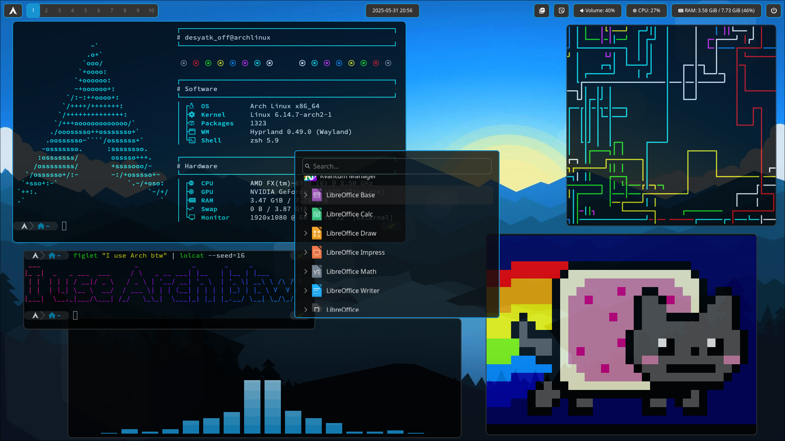

# Dotfiles

## Description

This repository stores my dotfiles that I personally use at the moment. You can use this as a base config

Please, check the `install.sh` script before launching (or even manually install, without the script)

## Features

* Simple & lightweight
* Smooth animations
* Configurations for:
    + Cava - CLI audio visualizer
    + Fastfetch - system info fetch
    + Helix - nice code editor (my favorite)
    + Kitty - terminal
    + Peaclock - clock with text-based user interface
    + Waybar - panel like Polybar but for Wayland instead of Xorg
        - "Application launcher" button with Arch icon (if you want to change icon, edit `waybar/config.jsonc` at 28 line)
        - Workspaces
        - Sound volume
        - "Clipboard" button
        - "Emoji" button
        - Clock: date and time
        - System tray
        - Temperature
        - CPU usage
        - RAM usage
        - "Exit current Hyprland session" button
    + Waypaper & SWWW - wallpaper management
    + Wofi - menu, application launcher
* Useful shortcuts
    + `Super` + `Enter` -> Launch Kitty
    + `Super` + `Q` -> Close current window
    + `Super` + `L` -> Exit current Hyprland session
    + `Super` + `E` -> Launch Dolphin
    + `Super` + `B` -> Launch Firefox
    + `Super` + `T` -> Toggle floating mode for current window
    + `Super` + `F` -> Toggle fullscreen mode for current window
    + `Super` + `V` -> Open clipboard
    + `Super` + `.` -> Open emoji picker
    + `Super` + `P` -> Toggle pseudo mode for current window
    + `Super` + `J` -> Toggle split mode
    + `Super` + `W` -> Toggle Waybar
    + `Print Screen` -> Take a screenshot
    + `Shift` + `Print Screen` -> Take a screenshot and edit before saving (crop, draw, blur, etc...)
    + Others (see `binds.conf` in `hypr/` directory for more)
* And the best feature is... The excellence of minimalistic Arch Linux Hyprland :)

## Preview

